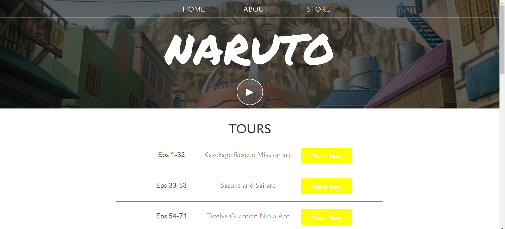
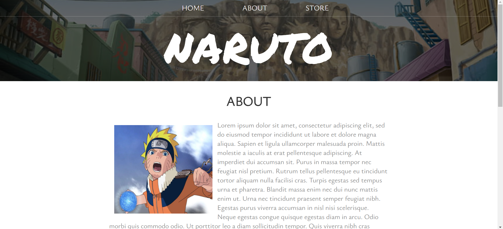
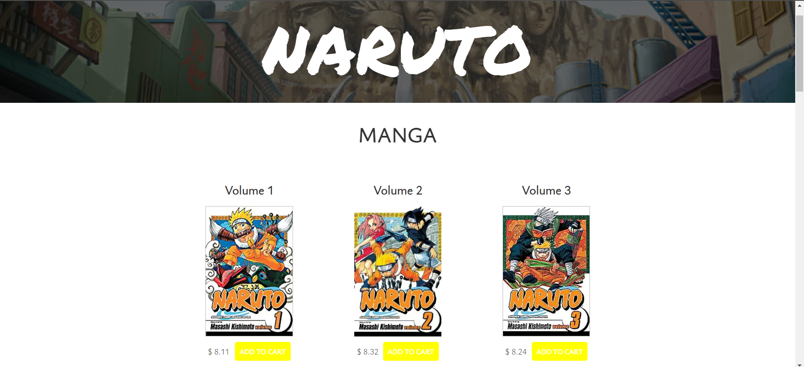
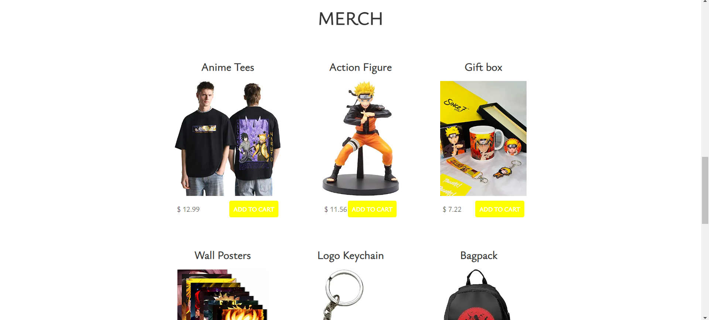
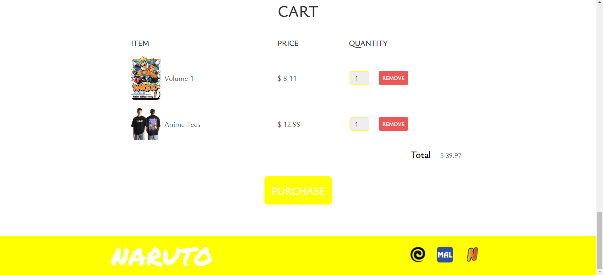

# Get started with Naruto

Welcome to Get Started with Naruto, a website dedicated to all things Naruto! This website is designed to provide Naruto fans with an interactive and immersive experience, allowing them to explore the various arcs of the Naruto anime, learn more about the series, and purchase their favorite Naruto manga volumes and merchandise.

## Table of Contents

- [Description](#description)
- [Technologies Used](#technologies-used)
- [Installation](#installation)
- [Usage](#usage)
- [Contributing](#contributing)
- [Contact](#contact)

## Description

The project is what it sounds like. It's all one needs to get started with the anime 'Naruto'. The project's home page provides a list of all arcs of the Naruto anime episode-wise under the 'Tours' section, and users can watch any arc as per their interest by clicking on the corresponding 'Watch now' buttons. The about page of the website contains a brief description of the anime. Additionally, the store page showcases various Naruto anime merchandise, such as manga volumes and other collectibles. Each item is accompanied by photos, prices, and an 'Add to cart' button, allowing users to easily add items to their shopping cart. The store page also features a cart section, displaying added items, quantities, total price, and purchase options.

Home page - 

About page - 

Store page: Manga section - 

Store page: Merch section - 

Store page: Cart section - 

## Technologies Used

- HTML
- CSS
- JavaScript

## Installation

To access the project, simply visit the website hosted on GitHub Pages at [https://shreyaa26.github.io/Get-started-with-Naruto](https://shreyaa26.github.io/Get-started-with-Naruto).

## Usage

- **Home Page - Exploring Arcs**: On the home page, navigate to the 'Tours' section to find a list of all Naruto anime arcs, organized episode-wise. Click on the 'Watch now' buttons to start watching your chosen arc.

- **About Page - Anime Overview**: Visit the 'About' page to read a brief overview of the Naruto anime, and its significance in popular culture.

- **Store Page - Collectibles**: Browse the 'Store' page to explore a variety of Naruto anime merchandise, including manga volumes and other collectibles. Each item is presented with a photo, price, and an option to 'Add to cart'.

- **Cart Section - Review and Purchase**: The cart section on the store page displays your selected items, quantities, and total price. Choose your desired items and quantities, and proceed to complete your purchase.

## Contributing

Contributions to this project are welcome and appreciated. If you would like to contribute, follow these general steps:

- Fork the repository: [https://shreyaa26.github.com//Get-started-with-Naruto](https://github.com/shreyaa26/Get-started-with-Naruto)

- Create a new branch: `git checkout -b feature/your-feature-name`

- Make your changes and commit them: `git commit -m 'Add your contribution'`

- Push to your forked repository: `git push origin feature/your-feature-name`

- Open a pull request to the main repository.

## Contact

For any questions, suggestions, or feedback, feel free to reach out to me [here](sarohashreya1102@gmail.com).

Connect with me on [GitHub](https://github.com/shreyaa26) and [LinkedIn](https://www.linkedin.com/in/shreya-saroha-a9222922a/).

